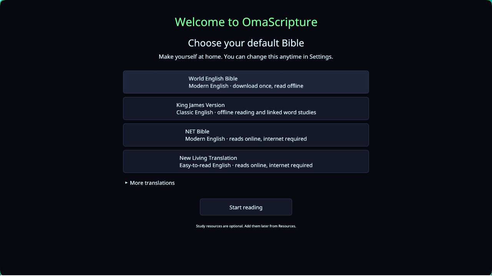

<p align="center">
  
</p>

<h1 align="center">OmaScripture</h1>

<p align="center"><strong>A quiet place to read. Room to study deeper.</strong></p>
<p align="center">A native Bible study app for Linux, built for <a href="https://omarchy.org">Omarchy</a>.</p>

<p align="center">
  <a href="#install">Install</a> ·
  <a href="#make-it-yours">First launch</a> ·
  <a href="docs/guide.md">User guide</a> ·
  <a href="https://github.com/zachwilke/omascripture/releases">Releases</a>
</p>


Read offline, compare translations, follow cross-references, and explore Greek
and Hebrew words—all in a desktop app that follows your Omarchy theme as it changes.

## Install

Paste this into your terminal:

```bash
curl -fsSL https://raw.githubusercontent.com/zachwilke/omascripture/main/setup.sh | bash
```

**No Rust. No sudo.** The installer downloads the app, verifies its checksum,
adds it to your app launcher, and opens it.

Works on **x86_64 Linux** with glibc 2.39 or newer, including current Omarchy.
Requires a Wayland/X11 desktop and OpenGL drivers.
[Other architectures or building from source →](docs/guide.md#build-from-source--optional-omarchy-integration)

## Make it yours

Choose a Bible, click **Start reading**, and you’re in.



| Your starting Bible | How it works |
|---|---|
| **World English Bible** | Modern English. Downloads once, reads offline. |
| **King James Version** | Classic English. Reads offline; supports linked word studies with optional language data. |
| **NET Bible** | Modern English. Reads online. |
| **New Living Translation** | Easy-to-read English. Reads online. |

Want another edition or language? Open **More translations** during setup.
Change your choice anytime in **Settings → Default Bible**.

## Read, explore, remember

| | |
|---|---|
| **Read comfortably** | Book and chapter navigation, adjustable text, light and dark themes, and automatic Omarchy colors. |
| **Compare Bibles** | Two translations side by side, following the same passage. |
| **Study a word** | Hover over linked KJV words for language details. Click **Word Study** for definitions, grammar, forms, and occurrences. |
| **Follow the context** | Cross-references, parallel passages, Greek and Hebrew interlinears, and classic commentaries. |
| **Keep your place** | Notes, highlights, bookmarks, reading plans, and your last reading position. |

Open **Resources** to add only the study tools you want. Available resources include
Matthew Henry, Barnes, Clarke, Calvin, Wesley, dictionaries, and STEPBible language data.
Offline Bibles and resources download once; online editions need internet access.

[Explore the study tools →](docs/guide.md#word-studies) ·
[Set up ESV and other online editions →](docs/guide.md#online-translations)

## Updates & your data

**Update:** run the install command again. Your downloaded Bibles, notes,
bookmarks, and preferences are preserved. Existing users skip first-launch setup.

**Install without opening the app:**

```bash
curl -fsSL https://raw.githubusercontent.com/zachwilke/omascripture/main/setup.sh | bash -s -- --no-launch
```

**Uninstall:**

```bash
bash ~/.local/share/omascripture/uninstall.sh
```

Your study data stays in `~/.local/share/omascripture/`. Back up that folder to
keep your library and notes safe. [Data and configuration →](docs/guide.md#data)

---

[Full guide](docs/guide.md) · [Development](docs/guide.md#development) ·
[Performance](PERFORMANCE.md) · [Report an issue](https://github.com/zachwilke/omascripture/issues)

OmaScripture is [MIT licensed](LICENSE). Bible texts and study datasets retain
their own [licenses and attribution](docs/guide.md#what-you-get).
The optional terminal interface is available with `omascripture --tui`.
