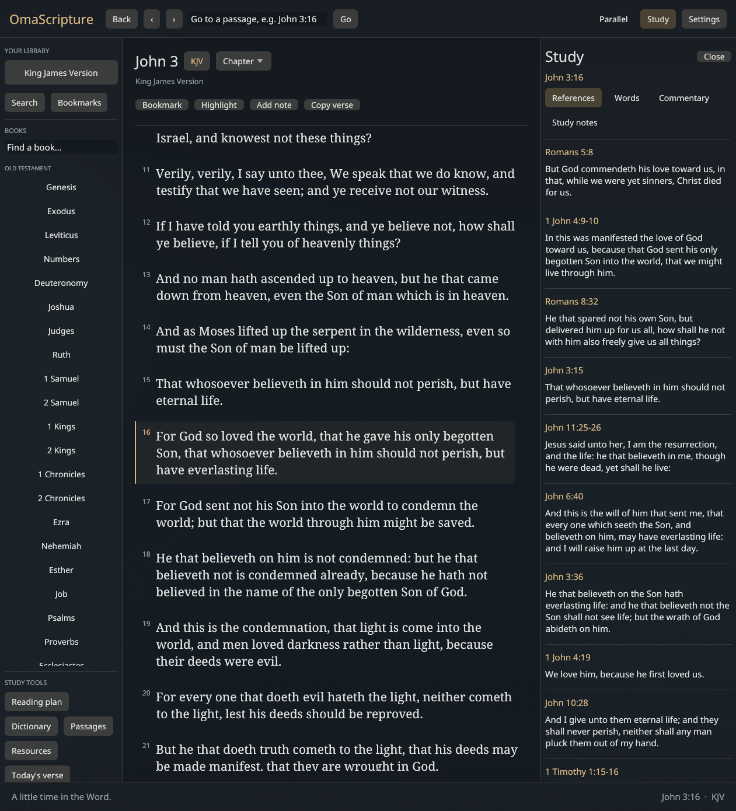

# OmaScripture

A native desktop Bible study app, built for
[Omarchy](https://omarchy.org), with an offline library of public-domain and Creative Commons resources,
plus optional online Bible providers for modern translations.

Read in any of 117 translations, open a study sidebar beside the text with
cross-references, a Greek and Hebrew interlinear, classic commentaries and
verse-by-verse notes, do word studies with lexicons and concordance, look up
names and places in five dictionaries, follow parallel passages, and keep a
reading plan. Offline resources are downloaded once. Online translations load chapters on demand
and require internet access.

OmaScripture opens in its own Wayland/X11 desktop window. It has a book navigator,
serif reading text, parallel Bibles, an adjustable study sidebar, and graphical
dialogs for your library, search, notes, reading plans, and settings. The optional
terminal interface is available with `--tui`.

The GUI follows Omarchy’s active colors by default and updates within about a
second when you change themes, including switches between light and dark themes.
Choose **Settings → Appearance → Follow Omarchy** to restore automatic theming
after a manual override. Outside Omarchy, a built-in palette is used.



## What you get

| Logos feature | OmaScripture | Source | Licence |
|---|---|---|---|
| Bible text | 117 translations: KJV, WEB, ASV, BSB, YLT, Darby, Douay-Rheims, Luther, Reina Valera, ... | getbible.net | Public domain / free |
| Parallel Bibles | Two translations side by side | | |
| Reverse interlinear | Every Greek and Hebrew word with Strong's number, morphology, transliteration, gloss | STEPBible TAGNT / TAHOT | CC BY 4.0 |
| Lexicons | Greek lexicon based on Abbott-Smith and LSJ; Hebrew based on BDB | STEPBible TBESG / TBESH | CC BY 4.0 |
| Concordance | Every occurrence of a word, by Strong's number | derived from the interlinear | |
| Cross-references | 340,000 weighted links | OpenBible.info | CC BY |
| | Treasury of Scripture Knowledge | CrossWire | Public domain |
| Commentaries | Matthew Henry, Barnes, Clarke, Jamieson-Fausset-Brown, Calvin, Wesley, Geneva notes | CrossWire SWORD modules | Public domain |
| Study notes | unfoldingWord Translation Notes on every verse | unfoldingWord | CC BY-SA 4.0 |
| Dictionaries | Easton's, Smith's, ISBE, Nave's Topical, Hitchcock's Names, unfoldingWord Translation Words | CrossWire, unfoldingWord | Public domain / CC BY-SA |
| Passage guide | Harmony of the Gospels, Old Testament parallels | built in | |
| Reading plans | Whole Bible, NT, Gospels, Psalms and Proverbs, OT, Wisdom | built in | |
| Notes and highlights | Bookmarks, four highlight colours, per-verse notes | stored as JSON | |
| Verse of the day | In the app and as an Omarchy bar widget | | |

ESV and NLT are available through their publishers’ online APIs. API.Bible can
provide other editions when your account has access; NIV/NASB availability is
not guaranteed. Commercial lexicons such as BDAG and HALOT are not included.

## Install on Omarchy

Requires a Rust toolchain (`omarchy install dev-env rust`) and a graphical Linux
session. The desktop frontend uses OpenGL through eframe, with Wayland and X11
support. Noto Serif/Sans system fonts are used when installed, with bundled font
fallbacks. CLI commands and `--tui` remain usable without a display.

```bash
git clone https://github.com/zachwilke/omascripture ~/Projects/omascripture
cd ~/Projects/omascripture
./install.sh --translation kjv --study basic --bar
```

| Flag | What it does |
|---|---|
| `--translation kjv` | download a Bible (any id from `omascripture --catalog`) |
| `--study basic` | cross-references, Greek interlinear and lexicon, Matthew Henry, Easton's (~60 MB) |
| `--study all` | every study pack (~200 MB) |
| `--study mhc,jfb,isbe` | a chosen set of pack ids |
| `--bar` | verse-of-the-day widget in the Omarchy bar; click opens the app |
| `--bind "SUPER + SHIFT + ALT + B"` | Hyprland keybinding |

The installer builds a release binary and sets up:

| What | Where |
|------|-------|
| Binary | `~/.local/bin/omascripture` |
| App launcher entry and icon | `~/.local/share/applications/io.github.zachwilke.OmaScripture.desktop` |
| Omarchy menu entry | `Super+Space → Learn → Bible`, also `omarchy menu summon bible` |
| Bar widget (with `--bar`) | a `command` module in `~/.config/omarchy/shell.json` |

Nothing under `/usr/share/omarchy` is modified. `./uninstall.sh` reverses all
of it and keeps your data unless you pass `--purge`.

## Using it

```bash
omascripture                       # open the desktop app where you left off
omascripture "Romans 8:28"         # open at a reference
omascripture -t web "Ps 23"        # pick the translation for this session
omascripture --tui                 # optional terminal interface
```

### Desktop interface

- **Navigate:** filter books in the left column, choose a chapter from the Chapter
  dropdown, or type a reference in the top bar. Back returns to the previous passage.
- **Read:** click a verse to select it. The Study sidebar follows your selection.
  Drag over text to select it; right-click for copying, bookmarks, highlights, or notes.
- **Compare:** click Parallel to choose a second Bible. Both panes follow the same
  passage and scroll independently.
- **Study:** open the adjustable right sidebar for cross-references, original-language
  words, commentaries, and translation notes. Click a reference or a word to explore it.
- **Keep notes:** click Add note, write in the editor, then Save note. Bookmarks and
  highlights are available above the reading text and in its context menu.
- **Build a library:** click Resources to install or remove study packs. Translation
  pickers offer explicit Open and Download buttons.
- **Continue a plan:** Reading plan lets you choose a schedule, open its chapters,
  and mark days complete.

Keyboard conveniences: `Ctrl+L` focuses the reference field, `Ctrl+F` opens search,
`Ctrl+,` opens Settings, and `Ctrl+S` saves an open note.

### Desktop settings

Click Settings in the top right. Choose default and parallel Bibles, adjust reading
text size, follow Omarchy’s theme or choose a light/dark appearance, set a reading-column width,
and choose startup behavior and sidebar preferences. Reading settings save immediately.

The Online Bibles section has masked fields for your ESV, optional NLT, and API.Bible
keys. Click **Save provider keys** to save them privately. Expand API.Bible editions
to add an authorized Bible ID and display name. No JSON editing is needed in the GUI.

### Online translations

Open the translation picker (the library button, a pane’s translation button, or Settings → Default Bible)
and filter for **NET**, **ESV**, or **NLT**. Online entries show whether they need a
key. They can also be your default or parallel translation:

```bash
omascripture -t net "John 3:16"   # no key
omascripture -t nlt "Psalm 23"   # anonymous access, or your own key
omascripture -t esv "Romans 8"   # personal ESV key required
omascripture --providers         # provider status and configuration path
```

Only the current chapter in each pane is held in memory. Text is evicted when
moving to another chapter and is never written to the offline library. Provider
errors stay visible in the pane; click **Retry chapter** to retry (`F5` in the terminal interface). Navigation, bookmarks, notes, reading plans, and study sidebars
work with online text. Whole-Bible search requires an offline translation.
NET translator notes are not imported by this integration.

Create a private configuration template (mode `0600` on Linux):

```bash
omascripture --init-providers
```

Edit `~/.config/omascripture/providers.json` in your editor:

```json
{
  "esv_key": "YOUR_ESV_KEY",
  "nlt_key": "",
  "api_bible_key": "YOUR_API_BIBLE_KEY",
  "api_bible": []
}
```

Leave unused keys empty. Get an ESV key at [Crossway](https://api.esv.org/).
NLT supports anonymous non-commercial access with a 50-verse request limit;
long chapters are fetched in batches. You can request a key from
[Tyndale](https://api.nlt.to/) for its higher limits. Use these services under
their current provider terms; no publisher keys are bundled with the app.

For NIV, NASB, or other API.Bible editions, obtain access through
[API.Bible](https://scripture.api.bible/), set your key, then run:

```bash
omascripture --api-bibles
```

This lists the IDs your key can access. Add the exact ID and a display name to
`api_bible`, for example `{"id": "AUTHORIZED-BIBLE-ID", "name": "My edition"}`.
It then appears in the picker; its command-line ID is `api-bible-AUTHORIZED-BIBLE-ID`.
An API key does not automatically grant access to every translation. The current
navigation model uses the standard 66-book Protestant canon; editions with
additional books or different chapter numbering need further support.

Environment variables `OMASCRIPTURE_ESV_KEY`, `OMASCRIPTURE_NLT_KEY`, and
`OMASCRIPTURE_API_BIBLE_KEY` override keys in the file. `OMASCRIPTURE_PROVIDERS`
overrides the configuration path. Settings shows provider status, never keys.
Keys are read again for each chapter request, so restarting is unnecessary.
The template command never overwrites an existing config.

Publisher text is separately licensed from the MIT application code. Provider
attribution appears below the reading text. See the
[NET copyright](https://netbible.com/copyright/),
[ESV conditions](https://api.esv.org/),
[NLT API documentation](https://api.nlt.to/Documentation), and
[API.Bible documentation](https://docs.api.bible/).

## Optional terminal interface

Run `omascripture --tui` to use the keyboard-and-mouse terminal renderer. The
following key reference applies to that interface; the desktop uses labeled controls.

### The study sidebar

Press `s` to open the sidebar, or `1` to `4` to jump straight to a tab. It
follows the selected verse.

1. **Cross-refs**: OpenBible links ranked by usefulness, plus Treasury of
   Scripture Knowledge entries. `Tab` into the sidebar, `Enter` jumps.
2. **Interlinear**: every original-language word with transliteration, gloss,
   Strong's number and morphology. `Enter` on a word opens a word study with
   the lexicon entry; `o` lists every occurrence, `Enter` jumps to one.
3. **Commentary**: the current commentary's entry for this verse, falling back
   to the nearest preceding comment. `C` cycles through installed commentaries.
4. **Notes**: unfoldingWord Translation Notes for the verse, with the
   original-language phrase each note is about.

### Other study tools

| Key | Tool |
|-----|------|
| `w` | interlinear words for this verse, ready for word study |
| `D` | look up a name, place or topic across every installed dictionary |
| `P` | parallel passages: Gospel harmony and Old Testament parallels |
| `r` | reading plans: start one, see today's chapters, mark days done |
| `R` | install or remove study resources |
| `,` | settings |
| `v` | verse of the day |
| `/` | search the whole translation; `n` / `N` step through results |
| `m` `B` | bookmark a verse, list bookmarks |
| `x` | cycle highlight colour |
| `e` | write a note on the verse (`Ctrl+S` saves) |
| `y` | copy verse and reference to the clipboard |

### Reading keys

| Key | Action |
|-----|--------|
| `j` / `k`, `↓` / `↑` | next / previous verse |
| `J` / `K`, `PgDn` / `PgUp` | jump 10 verses |
| `g` / `G` | first / last verse of chapter |
| `h` / `l`, `←` / `→` | previous / next chapter |
| `[` / `]` | previous / next book |
| `b`, `c` | choose book, choose chapter |
| `:` or `o` | go to a reference: `John 3:16`, `Ps 23`, `1 Jn 2`, `rev` |
| `u` / `Backspace` | back to where you jumped from |
| `t` / `T` | choose reading / parallel translation |
| `p` | show or hide the parallel pane |
| `F10` | open the menu bar |
| `?` | help |
| `q` | quit; position and study data are saved |

### Command line

```bash
omascripture --catalog             # every translation available
omascripture --download asv        # fetch a translation
omascripture --list                # downloaded translations
omascripture --resources           # every study pack, with licence and size
omascripture --install mhc         # fetch a pack (or: --install all)
omascripture --remove mhc
omascripture --votd                # verse of the day, plain text
omascripture --votd-bar            # verse of the day as bar JSON
```

## Data

Everything lives in `~/.local/share/omascripture/` (override with the
`OMASCRIPTURE_DATA` environment variable):

```
translations/<id>.json      cached translations from getbible.net
resources/<pack>/           study packs, each with installed.json
study.json                  bookmarks, highlights, notes, plan, last position
```

Bookmarks, highlights and notes are keyed by book, chapter and verse number,
so they follow you across translations. Study packs are ordinary files: SWORD
modules are kept as downloaded, STEPBible tables are split per book, and
unfoldingWord notes are the original TSV files.

## Development

```bash
cargo run -- "John 1"          # desktop
cargo run -- --tui "John 1"    # terminal
cargo test
```

| Module | Purpose |
|---|---|
| `bible.rs` | text model, translation store, getbible client, reference parsing |
| `resources.rs` | study pack registry, downloads, and parsers for STEPBible, OpenBible and unfoldingWord data |
| `sword.rs` | reader for CrossWire SWORD zCom/zCom4 commentaries and zLD/RawLD dictionaries |
| `v11n.rs` | KJV versification table (generated) used to index SWORD modules |
| `harmony.rs` | parallel passage table |
| `providers.rs` | online NET, ESV, NLT and API.Bible adapters, key configuration, chapter parsers |
| `plans.rs` | reading plans and date arithmetic |
| `votd.rs` | verse of the day rotation |
| `study.rs` | persisted study data |
| `app.rs` | shared study state, commands, background loading, and terminal input |
| `gui.rs` | native egui/eframe desktop window, reading panes and dialogs |
| `menu.rs` | menu bar and toolbar definitions |
| `settings.rs` | settings page rows and persistence |
| `ui.rs` | rendering; records clickable regions as it draws |

## Sources and licences

- Bible texts: [getbible.net](https://getbible.net), which serves public-domain and freely licensed texts from the CrossWire SWORD project.
- Interlinear and lexicons: [STEPBible-Data](https://github.com/STEPBible/STEPBible-Data) by Tyndale House, Cambridge, CC BY 4.0.
- Cross-references: [OpenBible.info](https://www.openbible.info/labs/cross-references/), CC BY.
- Commentaries, TSK and dictionaries: [CrossWire Bible Society](https://crosswire.org) SWORD modules, public domain.
- Translation Notes and Translation Words: [unfoldingWord](https://www.unfoldingword.org), CC BY-SA 4.0.

Check each resource's licence before redistributing its text. The application
itself is MIT licensed.

### Theme integration

The GUI reads `colors.toml` from `$XDG_STATE_HOME/omarchy/current/theme`
(default `~/.local/state/omarchy/current/theme`), with support for the older
`$XDG_CONFIG_HOME/omarchy/current/theme` location. It follows directory replacements
and keeps the last valid palette during incomplete writes. No theme hook is needed.
`OMASCRIPTURE_THEME_FILE=/path/to/colors.toml` selects a custom palette file and
also reloads it live. Appearance overrides are saved with your study settings.

## Reliability and recovery

The GUI reduces idle redraws, keeps browsing caches bounded, and scans word-study
corpora one book at a time. Measurements and reproducible profiling commands are
in [PERFORMANCE.md](PERFORMANCE.md).

Study changes are written through a private temporary file, synced, and atomically
replaced. `study.json.bak` holds the previous saved version. The app checkpoints
reading position and unfinished notes every three seconds and saves again on
normal exit. An unfinished note reopens on the next startup; the note editor’s
Cancel/Close controls explicitly discard that draft.

If `study.json` is damaged, the app recovers the backup when available and preserves
the damaged original as `study.json.corrupt.<timestamp>` on the next save. Without
a readable backup, it leaves the original untouched and reports the problem.

Save errors stay visible. **Retry save** handles temporary failures; **Export
recovery copy** (or **Export unsaved work** inside the note editor) writes in-memory changes to `study.json.recovery.<timestamp>`.
Two windows cannot silently overwrite each other’s notes: a stale window must
export its edits and reopen against the latest study file. A failed save keeps
the note editor open and blocks normal window closing until you resolve the error
or explicitly choose **Close without saving**.

These files live in `~/.local/share/omascripture` (or `OMASCRIPTURE_DATA`). Keep an
independent backup of that directory for protection against disk loss. The local
backup is one previous save, not a full version history.

Developer checks: `cargo test --locked`, `cargo clippy --locked --all-targets --
-D warnings`, and `cargo build --locked --release`. GitHub Actions runs these
checks for pushes and pull requests. Live provider tests remain opt-in because
they require network access; ESV and API.Bible still need authorized credentials
for end-to-end validation.

## Word studies

Hover over a KJV word to see its linked original-language form, lemma,
transliteration, Strong’s number, and expanded grammar. Click or right-click the
word and choose **Word Study**, **Copy word**, or **Search this word**. A translated
phrase may represent several original words; its menu lets you choose the word
or form to study. Greek and Hebrew words in the **Words** sidebar also have hover
information and open directly into Word Study.

Word Study includes contextual parsing, lexicon definitions, usage by book,
inflected forms, and matching verse references. Indexing runs in the background.
Counts distinguish individual word occurrences from verses, and show how many
books are installed. The NT count uses TAGNT’s NA28 text, excluding KJV-only
variants; the OT uses TAHOT’s Leningrad text. Extended Strong’s identities stay
separate when the source supplies them. These are corpus statistics, not counts
of the English translation’s spelling.

Install **Word study language data**, the Greek/Hebrew interlinears, and their
lexicons under **Study resources**. For the additional alignment/grammar pack:

```bash
omascripture --install word-study
```

KJV alignment comes from [CrossWire’s tagged KJV](https://gitlab.com/crosswire-bible-society/kjv),
whose [source attribution and distribution permission](https://wiki.crosswire.org/CrossWire_KJV)
are maintained by CrossWire. Grammar expansions and lexicons come from
[STEPBible Data](https://github.com/STEPBible/STEPBible-Data), CC BY 4.0,
Tyndale House Cambridge. The app downloads these datasets from their publishers.
It converts the KJV tags to word ranges, omits editorial notes from alignment,
and checks the entire displayed verse before attaching tags. Punctuation and
case differences are normalized; changed words or ordering disable alignment.
Greek contextual forms are also checked against CrossWire’s morphology when
available. The original data is not replaced with generated definitions.

Other editions—including NET, NLT, ESV, and API.Bible—do not currently supply
licensed word alignment through these providers. Their menus offer the verse’s
original words for explicit selection; they do not infer an English-to-Greek or
English-to-Hebrew match. This provides the core word-study workflow, not the full
set of proprietary Logos datasets and tools.
